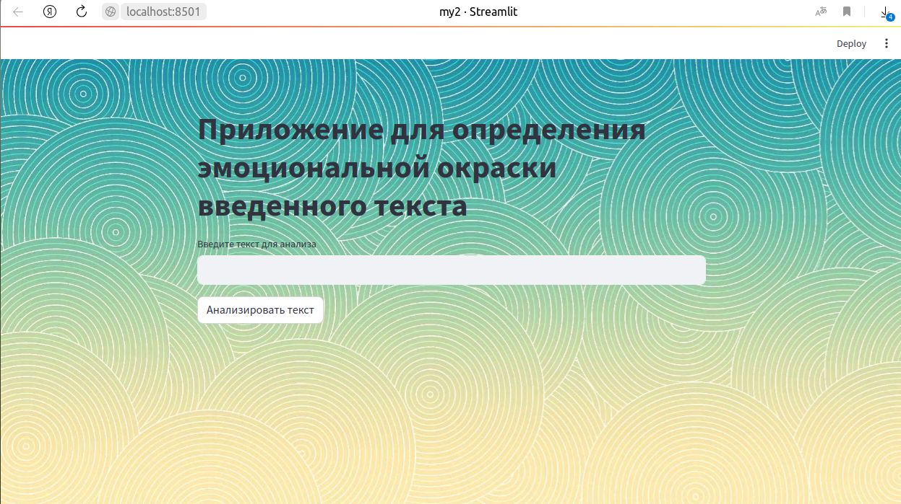

# Web приложение реализовано на модели для классификации эмоций в русских предложениях.
Необходимо ввести в поле предложение на русском языке и нажать кнопку "Анализировать текст"
Приложение выдаст результат в виде названия эмоциональной окраски текста:
 no emotion, joy, sadness, surprise, fear, anger, mean.

